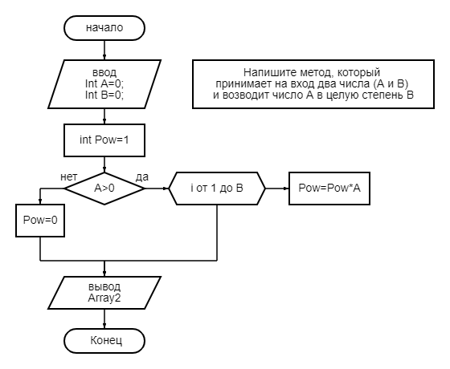

## Задача 25: Напишите метод, который принимает на вход два числа (A и B) и возводит число A в целую степень B.

3, 5 -> 243 (3⁵)

2, 4 -> 16

без использования math.pow
|["Код для решения задачи №25"](Exp001_pow\Program.cs)

## Задача 27: Напишите программу, которая принимает на вход число и выдаёт сумму цифр в числе.

452 -> 11

82 -> 10

9012 -> 12

## Задача 29: Напишите программу, которая задаёт массив из N элементов и выводит их на экран.

N = 5, получаем массив [1, 2, 5, 7, 19]

N = 3, получаем массив [6, 1, 33]